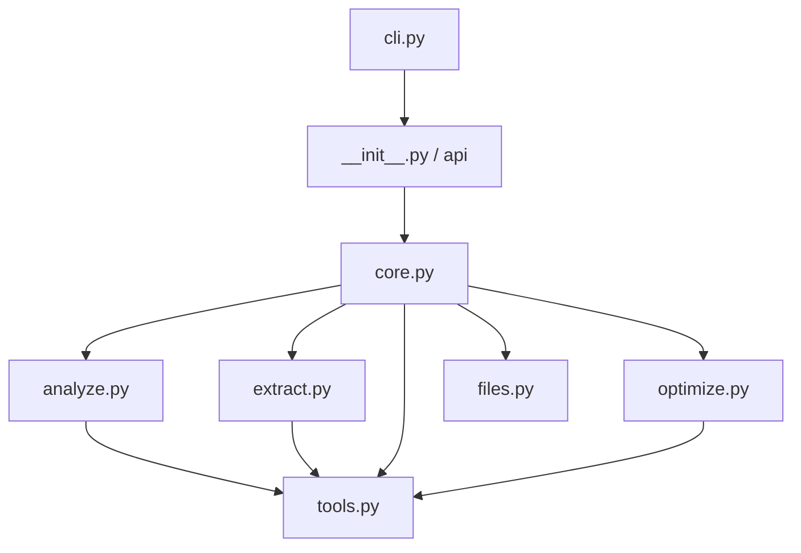

# Design Document: pdf-goon-refactor

## Overview

This design describes the refactoring of PDF-Goon v1.0.1 from a single 300-line script into a pip-installable Python package (`pdf_goon/`) with a clean public API and thin CLI layer. The refactoring preserves all existing behavior while introducing proper module boundaries, type safety, and testability.

The package follows Go-style coding principles: flat structure, explicit error handling via Result values, guard clauses with early returns, functions over classes, and zero third-party runtime dependencies.

### Design Decisions

1. **Flat package, no sub-packages** — All modules live directly in `pdf_goon/`. The codebase is small enough (~600 lines post-refactor) that sub-packages add navigation cost without benefit.
2. **Dataclasses for all structured data** — No TypedDicts, no plain dicts for domain objects. Consistent, type-checked, immutable where possible.
3. **Result_Value pattern for expected failures** — Functions that can fail in expected ways (missing tool, bad PDF) return a `ProcessResult` dataclass with success/failure info. Exceptions are reserved for programming errors.
4. **Dependency injection via callables** — Functions that shell out accept an optional `run_command` parameter, defaulting to the real implementation. Tests pass a mock.
5. **No utils.py** — Every function belongs to the module whose purpose it serves.

## Architecture

### Module Dependency Graph (DAG)



### Data Flow

```
CLI (argparse) 
  → Config dataclass 
    → process(config) [public API]
      → for each PDF:
          → analyze pages (pdfinfo, pdfimages -list)
          → for each page:
              → decide: extract or render
              → execute extraction/rendering (pdfimages / pdftocairo)
              → optimize output images (optional)
              → rename and move to output directory
          → handle source PDF (delete/trash/keep)
      → return list[ProcessResult]
```

## Components and Interfaces

### Module Layout

```
pdf_goon/
├── __init__.py      # Public API: process(), version, re-exports
├── cli.py           # Thin CLI: argparse → Config → process() → exit code
├── core.py          # Orchestration: process_batch, process_single_pdf
├── analyze.py       # PDF inspection: page count, image metadata, page dimensions
├── extract.py       # Image extraction and page rendering via Poppler
├── optimize.py      # Lossless image optimization (pingo/oxipng/jpegoptim)
├── files.py         # File operations: unique paths, cleanup, trash, workspace
├── tools.py         # Tool resolution and subprocess execution
└── models.py        # All dataclasses, enums, constants
```

**8 modules total** (including `__init__.py`). Each has a single clear purpose identifiable from its filename.

### Module Responsibilities and Public Signatures

#### `models.py` — Data definitions

All dataclasses, enums, and constants live here. No logic, no imports beyond `dataclasses`, `enum`, `pathlib`.

```python
@dataclass(frozen=True)
class Config:
    path: Path
    verbose: bool = False
    replace: bool = False
    optimize: bool = True
    dpi_text: int = 400
    min_width: int = 500
    recursive: bool = False
    force_render: bool = False
    debug: bool = False

class ProcessingMode(Enum):
    EXTRACT = "extract"
    RENDER = "render"

@dataclass(frozen=True)
class ImageInfo:
    width: int
    height: int
    color: str
    is_mask: bool

@dataclass(frozen=True)
class PageInfo:
    width_pts: float
    height_pts: float

@dataclass(frozen=True)
class PageDecision:
    mode: ProcessingMode
    dpi: float
    reason: str

@dataclass
class ProcessResult:
    pdf_path: Path
    success: bool
    pages_processed: int = 0
    error: str | None = None
```

Constants:
```python
VERSION: str = "1.0.1"
DPI_MIN: int = 36
DPI_MAX: int = 2400
MIN_WIDTH_DEFAULT: int = 500
TRICKY_COLORS: frozenset[str] = frozenset({"devn", "cmyk", "sep"})
```

#### `tools.py` — Tool resolution and subprocess execution

```python
def get_tool_path(tool_name: str) -> str:
    """Resolve path to a CLI tool (Poppler or optimizer)."""

def run_command(cmd: list[str]) -> str:
    """Execute a subprocess and return stdout. Filters irrelevant Poppler warnings."""

def check_poppler_available() -> list[str]:
    """Return list of missing required Poppler tools (empty = all present)."""

def check_optimizer_available(platform: str) -> bool:
    """Check if optimization tools are available for the given platform."""
```

#### `analyze.py` — PDF inspection

```python
def get_page_count(pdf_path: Path, *, run: Callable = run_command) -> int | None:
    """Return total page count, or None if PDF is unreadable."""

def get_image_data(pdf_path: Path, page_num: int, *, run: Callable = run_command) -> tuple[list[ImageInfo], list[str]]:
    """Return (images, mask_indices) for a given page."""

def get_page_info(pdf_path: Path, page_num: int, *, run: Callable = run_command) -> PageInfo:
    """Return physical page dimensions in points."""

def decide_processing_mode(
    images: list[ImageInfo],
    page_info: PageInfo,
    min_width: int,
    dpi_text: int,
    force_render: bool,
) -> PageDecision:
    """Determine whether to extract or render, and at what DPI."""
```

#### `extract.py` — Image extraction and rendering

```python
def extract_images(
    pdf_path: Path,
    page_num: int,
    output_prefix: Path,
    *,
    run: Callable = run_command,
) -> list[Path]:
    """Extract embedded images from a single page. Return list of output files."""

def render_page(
    pdf_path: Path,
    page_num: int,
    output_prefix: Path,
    dpi: float,
    page_info: PageInfo,
    *,
    run: Callable = run_command,
) -> list[Path]:
    """Render a page to PNG at the specified DPI. Return list of output files."""
```

#### `optimize.py` — Lossless image optimization

```python
def optimize_image(image_path: Path, *, run: Callable = run_command) -> int:
    """Optimize a single image file losslessly. Return bytes saved (0 on failure/skip)."""
```

#### `files.py` — File operations

```python
def get_unique_path(path: Path, is_dir: bool = False) -> Path:
    """Return a non-colliding path by appending (1), (2), etc."""

def is_network_path(path: Path) -> bool:
    """Check if path is on a network drive (UNC or mapped network on Windows)."""

def trash_or_move(pdf_path: Path, delete_dir: Path | None) -> None:
    """Move PDF to trash (platform-native) or to a !delete folder."""

def workspace_context(base_dir: Path | None = None):
    """Context manager that creates a temp workspace and guarantees cleanup."""
```

#### `core.py` — Orchestration

```python
def process_batch(
    config: Config,
    *,
    progress_callback: Callable[[int, int, Path], None] | None = None,
) -> list[ProcessResult]:
    """Process all PDFs matching config. Main orchestration loop."""

def process_single_pdf(
    pdf_path: Path,
    workspace: Path,
    config: Config,
    *,
    progress_callback: Callable[[int, int, Path], None] | None = None,
) -> ProcessResult:
    """Process one PDF file. Returns structured result."""
```

#### `__init__.py` — Public API

```python
from pdf_goon.models import Config, ProcessResult, VERSION

def process(
    path: str | Path = ".",
    *,
    verbose: bool = False,
    replace: bool = False,
    optimize: bool = True,
    dpi_text: int = 400,
    min_width: int = 500,
    recursive: bool = False,
    force_render: bool = False,
    debug: bool = False,
    progress_callback: Callable[[int, int, Path], None] | None = None,
) -> list[ProcessResult]:
    """Process PDF files at the given path. Primary public API."""
```

#### `cli.py` — CLI entry point

```python
def main() -> None:
    """Parse CLI arguments, call process(), print results, exit."""
```

The CLI module:
1. Prints the startup banner
2. Parses arguments with argparse (same flags as v1.0.1)
3. Constructs a `Config`
4. Calls `process()`
5. Handles top-level exceptions → exit code
6. Contains zero processing logic

## Data Models

### Config

```python
@dataclass(frozen=True)
class Config:
    """Validated runtime configuration. Immutable after construction."""
    path: Path
    verbose: bool = False
    replace: bool = False
    optimize: bool = True
    dpi_text: int = 400       # Clamped to [36, 2400]
    min_width: int = 500      # Pixels; images narrower than this trigger render
    recursive: bool = False
    force_render: bool = False
    debug: bool = False
```

Construction validates and clamps:
- `dpi_text` clamped to `[DPI_MIN, DPI_MAX]` with warning
- `path` resolved to absolute, existence checked
- `debug=True` implies `verbose=True`

A `make_config(**kwargs) -> Config` factory function handles validation and clamping, returning the frozen dataclass.

### ImageInfo

```python
@dataclass(frozen=True)
class ImageInfo:
    """Metadata for a single embedded image on a PDF page."""
    width: int
    height: int
    color: str       # e.g. "rgb", "gray", "cmyk", "devn", "sep"
    is_mask: bool    # True for smask/stencil entries
```

### PageInfo

```python
@dataclass(frozen=True)
class PageInfo:
    """Physical dimensions of a PDF page in points (1/72 inch)."""
    width_pts: float
    height_pts: float
```

### PageDecision

```python
@dataclass(frozen=True)
class PageDecision:
    """The processing decision for a single page."""
    mode: ProcessingMode   # EXTRACT or RENDER
    dpi: float             # Effective DPI for rendering (0 if extracting)
    reason: str            # Human-readable explanation for verbose output
```

### ProcessResult (Result_Value pattern)

```python
@dataclass
class ProcessResult:
    """Outcome of processing a single PDF file."""
    pdf_path: Path
    success: bool
    pages_processed: int = 0
    error: str | None = None
```

This is the Result_Value pattern: callers check `.success` rather than catching exceptions. Expected failures (unreadable PDF, missing pages) produce `ProcessResult(success=False, error="...")`. Unexpected failures (OS errors, programming bugs) still raise exceptions.

### ProcessingMode (Enum)

```python
class ProcessingMode(Enum):
    """How a page should be processed."""
    EXTRACT = "extract"   # Single clean image → pdfimages extraction
    RENDER = "render"     # Complex layout → pdftocairo rendering
```

### Constants

```python
VERSION = "1.0.1"
DPI_MIN = 36
DPI_MAX = 2400
MIN_WIDTH_DEFAULT = 500
PROGRESS_BAR_LENGTH = 20
TRICKY_COLORS = frozenset({"devn", "cmyk", "sep"})
POPPLER_TOOLS = ("pdfimages", "pdfinfo", "pdftocairo")
```

## Correctness Properties

*A property is a characteristic or behavior that should hold true across all valid executions of a system — essentially, a formal statement about what the system should do. Properties serve as the bridge between human-readable specifications and machine-verifiable correctness guarantees.*

### Property 1: DPI computation is always within valid bounds

*For any* valid page width in points (> 0) and any image width in pixels (> 0), the `decide_processing_mode` function SHALL produce a DPI value clamped to the range [36, 2400].

**Validates: Requirements 6.4, 7.1, 7.2**

### Property 2: Batch processing is resilient to individual failures

*For any* batch of PDF files where some files are invalid (unreadable, corrupt, zero pages), `process_batch` SHALL return a `ProcessResult` for every file in the batch — with `success=False` for failures — and SHALL process all remaining valid files without interruption.

**Validates: Requirements 5.3, 1.6**

### Property 3: Expected failures return Result_Value, never raise

*For any* expected failure condition (non-existent path, unreadable PDF, missing page data), the `process_single_pdf` function SHALL return a `ProcessResult` with `success=False` and a non-empty `error` string, rather than raising an exception.

**Validates: Requirements 16.5, 5.3**

### Property 4: Optimizer selects correct tool for platform and format

*For any* combination of operating system (`nt`, `posix`) and image file extension (`.png`, `.jpg`, `.jpeg`), the `optimize_image` function SHALL invoke the correct optimization tool: pingo on Windows for all formats, oxipng on Linux/macOS for PNG, jpegoptim on Linux/macOS for JPEG.

**Validates: Requirements 8.1**

### Property 5: Optimizer failure preserves the original file

*For any* image file where the optimization subprocess fails (non-zero exit code), the `optimize_image` function SHALL leave the original file unmodified and return 0 bytes saved, without raising an exception.

**Validates: Requirements 8.2**

### Property 6: Workspace cleanup is guaranteed regardless of outcome

*For any* invocation of `workspace_context`, whether the enclosed processing succeeds, fails with an expected error, or raises an unexpected exception, the workspace directory SHALL be removed (or removal attempted) upon exit from the context manager.

**Validates: Requirements 13.1, 13.2**

### Property 7: Config construction never produces invalid state

*For any* set of input parameters passed to `make_config`, the function SHALL either return a `Config` with `dpi_text` in [36, 2400] and `path` pointing to an existing location, OR raise a `ValueError` with a descriptive message — it SHALL never return a `Config` with out-of-range or invalid fields.

**Validates: Requirements 7.5, 7.1, 7.2, 7.3**

### Property 8: Unique path generation never collides with existing paths

*For any* filesystem state (set of existing paths) and any input path, `get_unique_path` SHALL return a path that does not exist in the filesystem state. If the input path does not exist, it SHALL be returned unchanged.

**Validates: Requirements 10.1 (file organization decomposition)**

### Property 9: Progress callback receives correct sequential indices

*For any* batch of N PDF files processed with a progress callback, the callback SHALL be invoked exactly N times with `(current, total, path)` where `current` ranges from 1 to N sequentially and `total` equals N for every call.

**Validates: Requirements 9.4, 9.2**

### Property 10: Subprocess failure exceptions contain diagnostic info

*For any* subprocess invocation that exits with a non-zero code, the raised exception SHALL contain the tool name, the exit code, and the stderr content as accessible attributes or in the message string.

**Validates: Requirements 5.1**

## Error Handling

### Strategy: Two-Track Error Model

The codebase uses a strict two-track error handling model inspired by Go:

**Track 1: Result_Value (expected failures)**
- File not found, unreadable PDF, zero pages, missing optional tools
- Functions return `ProcessResult(success=False, error="descriptive message")`
- Callers check `.success` and handle gracefully
- Never interrupts batch processing

**Track 2: Exceptions (unexpected failures)**
- OS-level errors (permission denied on workspace), programming bugs
- Raised as specific exception types (never bare `except`)
- Caught only at the top level (cli.py) for clean exit

### Exception Types

```python
class PdfGoonError(Exception):
    """Base exception for unexpected pdf_goon errors."""

class ToolNotFoundError(PdfGoonError):
    """Required Poppler tool is missing from the system."""
    def __init__(self, missing_tools: list[str]):
        self.missing_tools = missing_tools

class SubprocessError(PdfGoonError):
    """A subprocess exited with non-zero status unexpectedly."""
    def __init__(self, tool: str, exit_code: int, stderr: str):
        self.tool = tool
        self.exit_code = exit_code
        self.stderr = stderr
```

### Error Flow by Layer

| Layer | Expected Failure | Unexpected Failure |
|-------|-----------------|-------------------|
| `tools.py` | Returns empty string on filtered warnings | Raises `SubprocessError` on non-zero exit |
| `analyze.py` | Returns `None` / empty list for unreadable data | Propagates `SubprocessError` |
| `core.py` | Catches analysis failures → `ProcessResult(success=False)` | Propagates exceptions upward |
| `__init__.py` | Returns `list[ProcessResult]` with mixed success/failure | Propagates exceptions |
| `cli.py` | Prints error summary, exits 0 | Catches `PdfGoonError` → exit 1, others → exit 2 |

### Guard Clause Pattern

Every function checks preconditions first and returns early:

```python
def process_single_pdf(pdf_path: Path, workspace: Path, config: Config) -> ProcessResult:
    """Process one PDF file."""
    if not pdf_path.exists():
        return ProcessResult(pdf_path=pdf_path, success=False, error="File not found")

    page_count = get_page_count(pdf_path)
    if page_count is None:
        return ProcessResult(pdf_path=pdf_path, success=False, error="Cannot read page count")

    # ... main logic (no else-after-return)
```

## Testing Strategy

### Dual Testing Approach

**Property-Based Tests** (using `hypothesis` — dev dependency only):
- Verify universal properties across generated inputs
- Minimum 100 iterations per property
- Focus on pure logic: DPI calculation, config validation, unique path generation, extraction decisions
- Each test tagged: `# Feature: pdf-goon-refactor, Property N: <title>`

**Example-Based Unit Tests** (using `pytest`):
- Specific scenarios: known PDF structures, exact filename outputs
- Edge cases: empty pages, zero-width images, network paths
- Integration points: CLI argument parsing, tool resolution with mocked filesystem
- Error conditions: missing tools, corrupt PDFs, permission errors

### Test Organization

```
tests/
├── test_models.py       # Config validation, dataclass construction
├── test_tools.py        # Tool resolution, subprocess mocking
├── test_analyze.py      # Page parsing, DPI calculation, extraction decisions
├── test_extract.py      # Extraction/rendering with mocked subprocesses
├── test_optimize.py     # Optimizer tool selection, failure handling
├── test_files.py        # Unique paths, trash, workspace context manager
├── test_core.py         # Batch processing, progress callbacks
└── test_cli.py          # Argument parsing, exit codes
```

### Property Test Configuration

- Library: `hypothesis` (Python PBT library)
- Minimum iterations: 100 per property (`@settings(max_examples=100)`)
- Each property test references its design document property number
- Tag format: `# Feature: pdf-goon-refactor, Property {N}: {title}`

### What Is NOT Property-Tested

- CLI argument parsing (fixed set of arguments → example tests)
- File I/O operations (side-effectful → integration tests with tmp_path)
- Subprocess invocation (external tools → mocked example tests)
- Progress bar rendering (UI output → example tests)
- Backward compatibility (regression → integration tests comparing output)

### Dev Dependencies

```toml
[project.optional-dependencies]
dev = [
    "pytest>=7.0",
    "hypothesis>=6.0",
    "mypy>=1.0",
    "ruff>=0.1",
]
```

