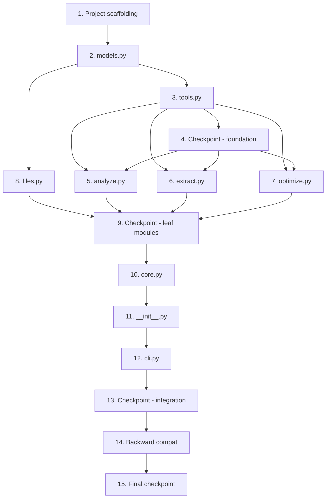

# Implementation Plan: pdf-goon-refactor

## Overview

Refactor PDF-Goon v1.0.1 from a single-file script into a pip-installable Python package (`pdf_goon/`) with clean module boundaries, type safety, and testability. Implementation follows the module dependency graph bottom-up, ensuring each module is independently testable before wiring together.

## Tasks

- [x] 1. Project scaffolding and package structure
  - [x] 1.1 Create `pyproject.toml` with project metadata, console_scripts entry point, and dev dependencies
    - Package name: `pdf-goon`, version `1.0.1`
    - Entry point: `pdf-goon = pdf_goon.cli:main`
    - Dev dependencies: pytest, hypothesis, mypy, ruff
    - Python requires: `>=3.11`
    - _Requirements: 1.4, 11.1, 11.4_

  - [x] 1.2 Create package directory structure and empty module files
    - Create `pdf_goon/__init__.py`, `models.py`, `tools.py`, `analyze.py`, `extract.py`, `optimize.py`, `files.py`, `core.py`, `cli.py`
    - Create `tests/` directory with `__init__.py` and empty test files matching each module
    - _Requirements: 1.1, 2.1, 2.4_

- [x] 2. Implement `models.py` — Data definitions (no dependencies)
  - [x] 2.1 Define all dataclasses, enums, and constants
    - `Config` (frozen dataclass with all fields and defaults)
    - `ProcessingMode` enum (EXTRACT, RENDER)
    - `ImageInfo`, `PageInfo`, `PageDecision`, `ProcessResult` dataclasses
    - Constants: `VERSION`, `DPI_MIN`, `DPI_MAX`, `MIN_WIDTH_DEFAULT`, `PROGRESS_BAR_LENGTH`, `TRICKY_COLORS`, `POPPLER_TOOLS`
    - `make_config(**kwargs) -> Config` factory with validation/clamping
    - Exception classes: `PdfGoonError`, `ToolNotFoundError`, `SubprocessError`
    - _Requirements: 4.1, 4.2, 4.3, 7.1, 7.2, 7.3, 7.5, 16.11_

  - [x] 2.2 Write property test: Config construction never produces invalid state
    - **Property 7: Config construction never produces invalid state**
    - Use hypothesis to generate arbitrary dpi_text and path values
    - Assert: returned Config always has dpi_text in [36, 2400], or ValueError is raised
    - **Validates: Requirements 7.5, 7.1, 7.2, 7.3**

  - [x] 2.3 Write unit tests for models
    - Test Config defaults, clamping behavior, debug implies verbose
    - Test ProcessingMode enum values
    - Test dataclass immutability (frozen)
    - Test exception classes carry expected attributes
    - _Requirements: 4.2, 7.1, 7.2_

- [x] 3. Implement `tools.py` — Tool resolution and subprocess execution (depends on models)
  - [x] 3.1 Implement tool resolution and subprocess functions
    - `get_tool_path(tool_name: str) -> str` — resolve tool path (PyInstaller, local, PATH)
    - `run_command(cmd: list[str]) -> str` — execute subprocess, filter Poppler warnings, raise `SubprocessError` on failure
    - `check_poppler_available() -> list[str]` — return missing required tools
    - `check_optimizer_available(platform: str) -> bool` — check optimizer availability
    - _Requirements: 5.1, 5.4, 6.2, 12.4, 16.5_

  - [x] 3.2 Write property test: Subprocess failure exceptions contain diagnostic info
    - **Property 10: Subprocess failure exceptions contain diagnostic info**
    - Generate arbitrary tool names, exit codes (non-zero), and stderr strings
    - Assert: raised SubprocessError contains tool name, exit code, and stderr
    - **Validates: Requirements 5.1**

  - [x] 3.3 Write unit tests for tools
    - Test get_tool_path resolution order (MEIPASS, local, PATH)
    - Test run_command filters irrelevant Poppler warnings
    - Test run_command raises SubprocessError on non-zero exit
    - Test check_poppler_available with mocked shutil.which
    - _Requirements: 5.1, 5.4, 6.2_

- [x] 4. Checkpoint — Verify foundation modules
  - Ensure all tests pass, ask the user if questions arise.

- [x] 5. Implement `analyze.py` — PDF inspection (depends on tools, models)
  - [x] 5.1 Implement PDF analysis functions
    - `get_page_count(pdf_path, *, run=run_command) -> int | None`
    - `get_image_data(pdf_path, page_num, *, run=run_command) -> tuple[list[ImageInfo], list[str]]`
    - `get_page_info(pdf_path, page_num, *, run=run_command) -> PageInfo`
    - `decide_processing_mode(images, page_info, min_width, dpi_text, force_render) -> PageDecision`
    - Port parsing logic from v1.0.1 `get_image_data`, `get_page_info`, and the decision logic in `process_single_pdf`
    - _Requirements: 6.1, 6.4, 10.1, 10.3, 16.8_

  - [x] 5.2 Write property test: DPI computation is always within valid bounds
    - **Property 1: DPI computation is always within valid bounds**
    - Use hypothesis to generate page widths (> 0) and image widths (> 0)
    - Assert: decide_processing_mode always produces DPI in [36, 2400]
    - **Validates: Requirements 6.4, 7.1, 7.2**

  - [x] 5.3 Write unit tests for analyze
    - Test get_page_count with mocked pdfinfo output
    - Test get_image_data parsing of pdfimages -list output (masks, tricky colors)
    - Test get_page_info parsing with C-float simulation
    - Test decide_processing_mode: single image extract, multi-image render, force_render, icon detection
    - _Requirements: 6.1, 6.4, 10.1_

- [x] 6. Implement `extract.py` — Image extraction and rendering (depends on tools, models)
  - [x] 6.1 Implement extraction and rendering functions
    - `extract_images(pdf_path, page_num, output_prefix, *, run=run_command) -> list[Path]`
    - `render_page(pdf_path, page_num, output_prefix, dpi, page_info, *, run=run_command) -> list[Path]`
    - Port pdfimages and pdftocairo invocation logic from v1.0.1
    - Include GEGL-style surface calculation for render dimensions
    - _Requirements: 6.1, 6.2, 10.1, 12.2_

  - [x] 6.2 Write unit tests for extract
    - Test extract_images builds correct pdfimages command
    - Test render_page builds correct pdftocairo command with calculated dimensions
    - Test render_page surface calculation matches v1.0.1 behavior
    - Mock run_command and verify command arguments
    - _Requirements: 6.2, 12.2_

- [x] 7. Implement `optimize.py` — Lossless image optimization (depends on tools, models)
  - [x] 7.1 Implement optimize_image function
    - `optimize_image(image_path: Path, *, run=run_command) -> int`
    - Select correct tool based on `os.name` and file extension
    - Return bytes saved (0 on failure/skip)
    - Handle subprocess failure gracefully (log warning, preserve file)
    - _Requirements: 8.1, 8.2, 8.3, 8.4_

  - [x] 7.2 Write property test: Optimizer selects correct tool for platform and format
    - **Property 4: Optimizer selects correct tool for platform and format**
    - Generate combinations of platform (nt, posix) and extension (.png, .jpg, .jpeg)
    - Assert: correct tool is invoked (pingo on Windows, oxipng for PNG on posix, jpegoptim for JPEG on posix)
    - **Validates: Requirements 8.1**

  - [x] 7.3 Write property test: Optimizer failure preserves the original file
    - **Property 5: Optimizer failure preserves the original file**
    - Generate image paths where subprocess fails (non-zero exit)
    - Assert: original file is unmodified and function returns 0
    - **Validates: Requirements 8.2**

  - [x] 7.4 Write unit tests for optimize
    - Test tool selection logic for each platform/format combination
    - Test bytes-saved calculation when optimization succeeds
    - Test graceful handling when optimizer tool is missing
    - _Requirements: 8.1, 8.2, 8.3_

- [x] 8. Implement `files.py` — File operations (depends on models)
  - [x] 8.1 Implement file management functions
    - `get_unique_path(path: Path, is_dir: bool = False) -> Path`
    - `is_network_path(path: Path) -> bool`
    - `trash_or_move(pdf_path: Path, delete_dir: Path | None) -> None` — platform-native trash (ctypes on Windows, freedesktop on Linux) with fallback
    - `workspace_context(base_dir: Path | None = None)` — context manager for temp workspace with guaranteed cleanup
    - _Requirements: 10.1, 11.2, 13.1, 13.2, 13.3, 13.4_

  - [x] 8.2 Write property test: Unique path generation never collides
    - **Property 8: Unique path generation never collides with existing paths**
    - Generate sets of existing paths and input paths
    - Assert: returned path does not exist in the filesystem state; unchanged input returned if no collision
    - **Validates: Requirements 10.1**

  - [x] 8.3 Write property test: Workspace cleanup is guaranteed
    - **Property 6: Workspace cleanup is guaranteed regardless of outcome**
    - Test workspace_context with success, expected error, and unexpected exception
    - Assert: workspace directory is removed in all cases
    - **Validates: Requirements 13.1, 13.2**

  - [x] 8.4 Write unit tests for files
    - Test get_unique_path with no collision, single collision, multiple collisions
    - Test is_network_path for UNC paths and local paths
    - Test trash_or_move fallback to !delete folder
    - Test workspace_context cleanup on exception
    - _Requirements: 10.1, 11.2, 13.1, 13.2_

- [x] 9. Checkpoint — Verify all leaf modules
  - Ensure all tests pass, ask the user if questions arise.

- [x] 10. Implement `core.py` — Orchestration (depends on analyze, extract, optimize, files, tools, models)
  - [x] 10.1 Implement batch processing and single-PDF orchestration
    - `process_batch(config, *, progress_callback=None) -> list[ProcessResult]`
    - `process_single_pdf(pdf_path, workspace, config, *, progress_callback=None) -> ProcessResult`
    - Wire together: analyze → decide → extract/render → optimize → rename/move
    - Implement guard clauses for early failure (file not found, unreadable, zero pages)
    - Handle per-file errors without interrupting batch
    - Implement progress bar logic (stdout) and verbose output
    - _Requirements: 1.6, 5.3, 9.1, 9.2, 9.3, 10.1, 10.2, 12.2, 16.5, 16.8_

  - [x] 10.2 Write property test: Batch processing is resilient to individual failures
    - **Property 2: Batch processing is resilient to individual failures**
    - Generate batches with mix of valid and invalid PDF paths
    - Assert: ProcessResult returned for every file; valid files still processed
    - **Validates: Requirements 5.3, 1.6**

  - [x] 10.3 Write property test: Expected failures return Result_Value, never raise
    - **Property 3: Expected failures return Result_Value, never raise**
    - Generate expected failure conditions (non-existent path, unreadable PDF)
    - Assert: ProcessResult with success=False and non-empty error returned, no exception raised
    - **Validates: Requirements 16.5, 5.3**

  - [x] 10.4 Write property test: Progress callback receives correct sequential indices
    - **Property 9: Progress callback receives correct sequential indices**
    - Generate batches of N files with a recording callback
    - Assert: callback invoked N times with current from 1..N and total=N
    - **Validates: Requirements 9.4, 9.2**

  - [x] 10.5 Write unit tests for core
    - Test process_single_pdf with mocked analyze/extract/optimize
    - Test batch continues after individual file failure
    - Test progress callback invocation order
    - Test guard clause early returns for missing files
    - _Requirements: 5.3, 9.2, 10.1, 16.8_

- [x] 11. Implement `__init__.py` — Public API (depends on core, models)
  - [x] 11.1 Implement public API surface
    - Export `process()` function with keyword arguments matching Config fields
    - Re-export `Config`, `ProcessResult`, `VERSION`
    - `process()` constructs Config via `make_config`, calls `process_batch`, returns results
    - No side effects on import
    - _Requirements: 1.2, 1.5, 1.6, 7.6, 9.4_

  - [x] 11.2 Write unit tests for public API
    - Test that importing pdf_goon has no side effects
    - Test process() constructs Config and delegates to core
    - Test process() accepts progress_callback
    - _Requirements: 1.2, 1.5, 9.4_

- [x] 12. Implement `cli.py` — CLI entry point (depends on __init__, models)
  - [x] 12.1 Implement thin CLI module
    - Startup banner, argparse with same flags as v1.0.1
    - Construct Config, call `process()`, handle top-level exceptions → exit codes
    - Zero processing logic — max 30 lines of logic
    - Exit codes: 0 success, 1 PdfGoonError, 2 unexpected error
    - _Requirements: 1.3, 12.1, 12.3, 16.1, 16.2, 16.3_

  - [x] 12.2 Write unit tests for CLI
    - Test argument parsing matches v1.0.1 flags and defaults
    - Test exit codes for success, PdfGoonError, unexpected error
    - Test banner output
    - _Requirements: 12.1, 12.3, 16.1_

- [x] 13. Checkpoint — Verify full package integration
  - Ensure all tests pass, ask the user if questions arise.

- [x] 14. Backward compatibility and integration verification
  - [x] 14.1 Add integration tests comparing refactored output to v1.0.1 behavior
    - Test CLI argument compatibility (all flags accepted with same defaults)
    - Test output filename format matches v1.0.1 (e.g., `001.png`, `002_r.png`)
    - Test exit code behavior matches v1.0.1
    - Test configuration summary output format
    - _Requirements: 12.1, 12.2, 12.3_

  - [x] 14.2 Add logging infrastructure
    - Replace print statements with Python logging module
    - Configure log levels: ERROR, WARNING, INFO, DEBUG
    - Separate progress output (stdout) from diagnostic logging (stderr)
    - _Requirements: 14.1, 14.2, 14.3, 14.4_

  - [x] 14.3 Run mypy strict and ruff checks, fix any issues
    - Ensure `mypy --strict` passes on all modules
    - Ensure `ruff check` passes with I, UP, SIM rule categories
    - Fix import ordering: stdlib, blank line, local imports
    - _Requirements: 4.4, 16.24, 16.25_

- [x] 15. Final checkpoint — Ensure all tests pass
  - Ensure all tests pass, ask the user if questions arise.

## Task Dependency Graph



```json
{
  "waves": [
    { "tasks": [1], "description": "Project scaffolding and package structure" },
    { "tasks": [2], "description": "Data definitions (models.py)" },
    { "tasks": [3, 8], "description": "Tool resolution and file operations" },
    { "tasks": [4], "description": "Foundation checkpoint" },
    { "tasks": [5, 6, 7], "description": "Leaf modules (analyze, extract, optimize)" },
    { "tasks": [9], "description": "Leaf modules checkpoint" },
    { "tasks": [10], "description": "Core orchestration" },
    { "tasks": [11], "description": "Public API" },
    { "tasks": [12], "description": "CLI entry point" },
    { "tasks": [13], "description": "Integration checkpoint" },
    { "tasks": [14], "description": "Backward compatibility" },
    { "tasks": [15], "description": "Final checkpoint" }
  ]
}
```

## Notes

- Tasks marked with `*` are optional and can be skipped for faster MVP
- Each task references specific requirements for traceability
- Checkpoints ensure incremental validation after each layer of the dependency graph
- Property tests validate universal correctness properties from the design document
- Unit tests validate specific examples and edge cases
- The implementation follows the module dependency graph bottom-up to ensure each module is testable in isolation before integration
- All modules use dependency injection via `run` callable parameter for testability
